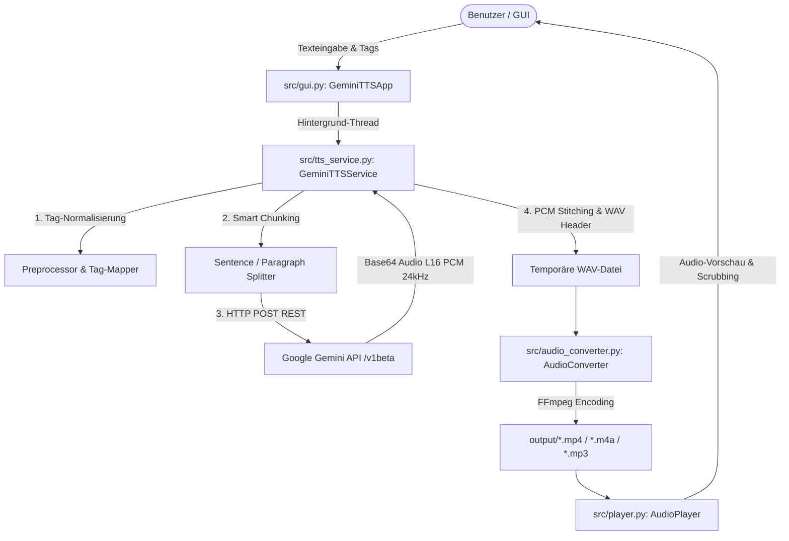

# System Architecture & Technical Specifications

Dieses Dokument beschreibt die Architektur, Datenflüsse und technischen Implementierungsdetails von **Gemini TTS Studio**. Es dient als umfassende Referenz für Entwickler und KI-Assistenten, die das Projekt warten oder erweitern.

---

## 1. Systemübersicht & Komponenten



---

## 2. Detaillierte Komponentenbeschreibung

### 2.1 Backend & TTS Engine (`src/tts_service.py`)
- **API-Endpunkt**: `https://generativelanguage.googleapis.com/v1beta/models/{model}:generateContent?key={api_key}`
- **Modelle**:
  - `gemini-3.1-flash-tts-preview` (Standard): Schnellste Generierung mit nativer Audioausgabe.
  - `gemini-2.5-flash-preview-tts` (Automatischer Fallback): Robuste Fallback-Engine bei Streaming-Hiccups.
  - `gemini-2.5-pro-preview-tts`: Studio-Qualität.
- **Audio-Tags / Regieanweisungen**:
  - Gemini TTS unterstützt Inline-Tags in eckigen Klammern (z. B. `[laugh]`, `[whisper]`, `[sad]`, `[excited]`, `[pause]`, `[sigh]`, `[slow]`, `[fast]`).
  - Der `TAG_REPLACEMENTS`-Mapper übersetzt deutsche Tags (`[lachen]`, `[flüstern]`, `[traurig]`, `[begeistert]`, `[Pause]`, `[seufzen]`, `[wütend]`, `[nachdenklich]`, `[langsam]`, `[schnell]`) automatisch in die vom Modell optimal verstandenen Direktiven.
- **Smart Chunking Engine**:
  - Um HTTP-Read-Timeouts (`timeout=60/120`) bei Texten beliebiger Länge zu verhindern, teilt `split_text_into_chunks()` längere Texte an Absatz- (`\n\n`) und Satzgrenzen (`. `, `! `, `? `) in handhabbare Einheiten (~300–350 Zeichen).
  - Jedes Text-Chunk wird sequentiell an die Gemini API gesendet.
  - Die zurückgegebenen 16-Bit-PCM-Audio-Frames werden binär verkettet (`b"".join(pcm_frames)`).
  - Die zusammengefügten PCM-Daten werden in eine standardkonforme WAV-Datei mit 24.000 Hz Abtastrate und 1 Kanal (Mono) konvertiert.

### 2.2 Audio-Konvertierung & FFmpeg (`src/audio_converter.py`)
- **Binary-Bereitstellung**: Sucht automatisch nach dem in `imageio-ffmpeg` eingebetteten FFmpeg-Binary oder nutzt das System-FFmpeg auf `PATH`.
- **Zielprofil (Web-Streaming Standard)**:
  ```bash
  ffmpeg -i eingabe.wav -c:a aac -b:a 64k -ac 1 -ar 44100 -movflags +faststart ausgabe.mp4
  ```
  - **Codec**: `aac` (AAC-LC für maximale Browser- und Plattformkompatibilität).
  - **Kanäle**: `1` (Mono, halbiert die Datenrate).
  - **Bitrate**: `64k` (64 kbit/s, optimaler Kompromiss aus Sprachklarheit und Bandbreite).
  - **Abtastrate**: `44100 Hz` oder `48000 Hz`.
  - **Container**: MP4 / M4A mit Flag `-movflags +faststart` (verschiebt den `moov`-Atom an den Dateianfang für verzögerungsfreies Web-Streaming).
- **Zusätzliche Formate**: Unterstützt M4A, MP3 (`libmp3lame`) und unkomprimiertes WAV (`pcm_s16le`).

### 2.3 Audio-Player & Scrubbing (`src/player.py`)
- Nutzt `pygame.mixer` für latenzfreie Audiowiedergabe.
- **Scrubbing / Spulen**: Die Methode `seek(target_seconds)` erlaubt das direkte Anspringen jeder beliebigen Zeitposition (`pygame.mixer.music.play(start=target_seconds)`).
- Für MP4/M4A-Container wird im Hintergrund ein temporäres WAV-Vorschaufile erzeugt, um präzises Scrubbing und Metadaten-Berechnung zu garantieren.

### 2.4 Benutzeroberfläche (`src/gui.py`)
- Basiert auf **CustomTkinter** mit Dark/Light-Mode-Unterstützung.
- **`AutoScrollableFrame`**: Eigene Frame-Klasse mit intelligenter Scrollbalken-Steuerung. Wenn alle UI-Elemente in das Fenster passen, wird der Scrollbalken vollständig ausgeblendet. Wird das Fenster verkleinert oder der Inhalt erweitert, blendet sich der Scrollbalken automatisch ein.
- **Multithreading**: Die Sprachgenerierung und Konvertierung laufen in einem separaten `threading.Thread`, sodass die Oberfläche zu keinem Zeitpunkt einfriert.
- **Dynamischer Fortschrittsbalken**: Zeigt während der Synthese den prozentualen Fortschritt und Statusmeldungen in Echtzeit an.

### 2.5 Konfiguration & Secrets (`src/config.py`)
- Liest `GEMINI_API_KEY` und `GEMINI_TTS_MODEL` aus der `.env`-Datei.
- Erkennt automatisch, ob die Anwendung als Python-Skript oder als kompilierte PyInstaller-EXE (`sys.frozen`) ausgeführt wird, und sucht/speichert `.env` relativ zur ausführbaren Datei.

---

## 3. Datenfluss & Verzeichnisstruktur

```
TTS-Interface/
├── .env                      # Lokale API-Keys (wird von Git ignoriert)
├── .env.example              # Vorlage für Umgebungsvariablen
├── .gitignore                # Schützt Secrets, Caches, Audio-Dateien
├── README.md                 # Allgemeine Projektübersicht & Schnellstart
├── requirements.txt          # Python-Abhängigkeiten
├── main.py                   # Haupteinstiegspunkt der Anwendung
├── build_exe.py              # Automatisches Build-Skript für Standalone-EXE
├── build.bat                 # 1-Klick-Build für Windows
├── test_tts.py               # Test- & Verifikationsskript für Pipeline
├── docs/                     # Umfassende Entwickler- & KI-Dokumentation
│   ├── ARCHITECTURE.md       # Technische Architektur (dieses Dokument)
│   └── AI_HANDOVER.md        # Leitfaden für KI-Agenten & Weiterentwicklung
├── src/                      # Quellcode-Module
│   ├── __init__.py
│   ├── config.py             # Konstanten, Presets, Stimmen & Pfade
│   ├── tts_service.py        # Gemini API Client & Smart Chunking
│   ├── audio_converter.py    # FFmpeg-Encoding-Pipeline
│   ├── player.py             # Pygame Audio-Player mit Scrubbing
│   └── gui.py                # CustomTkinter GUI mit AutoScroll
├── output/                   # Generierte Ausgabedateien (vom Git ignoriert)
└── temp/                     # Temporäre PCM/WAV Zwischenstände (vom Git ignoriert)
```
