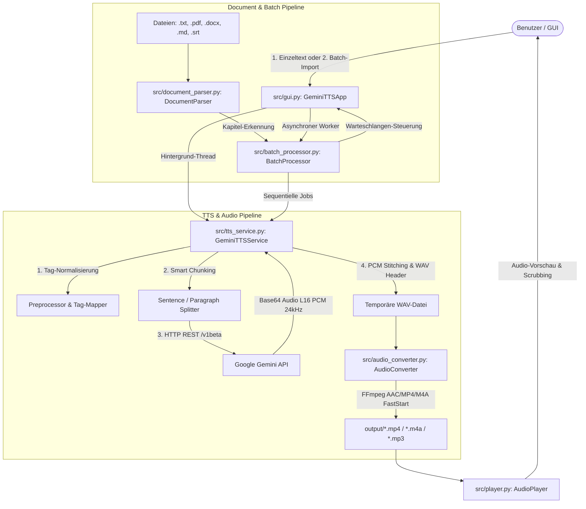

# System Architecture & Technical Specifications

Dieses Dokument beschreibt die Architektur, Datenflüsse und technischen Implementierungsdetails von **Gemini TTS Studio**. Es dient als umfassende Referenz für Entwickler und KI-Assistenten, die das Projekt warten oder erweitern.

---

## 1. Systemübersicht & Komponenten



---

## 2. Detaillierte Komponentenbeschreibung

### 2.1 Dokumenten-Parser (`src/document_parser.py`)
- **Unterstützte Formate**:
  - `.txt` / `.md`: Multi-Encoding-Leser (UTF-8, UTF-8-sig, CP1252, Latin-1).
  - `.pdf`: Extraktion aller lesbaren Seiten via `pypdf.PdfReader`.
  - `.docx`: Paragraph- & Tabellentext-Extraktion via `python-docx`.
  - `.srt`: Entfernt Untertitel-Sequenznummern und Timecodes für reine Sprachausgabe.
- **Kapitel-Splitting (`split_into_chapters`)**:
  - Erkennt Markdown-Überschriften (`# `, `## `, `### `) sowie strukturierte Textmarker (`Kapitel 1: ...`, `Chapter 2 ...`, `Teil 3 ...`).
  - Liefert durchnummerierte Kapitel-Tupel `[(Titel, Text), ...]`.

### 2.2 Batch- & Queue-Manager (`src/batch_processor.py`)
- Verwaltet die `BatchItem`-Warteschlange (ID, Quelldatei, Kapitel-Titel, Zeichen-/Wortanzahl, Status, Fortschritt, Ausgabepfad).
- Führt die Stapelgenerierung sequentiell im Hintergrund aus.
- Bietet Abbruch-Unterstützung (`cancel()`) und Fortschritts-Callbacks pro Aufgabe sowie für den gesamten Batch.

### 2.3 Backend & TTS Engine (`src/tts_service.py`)
- **API-Endpunkt**: `https://generativelanguage.googleapis.com/v1beta/models/{model}:generateContent?key={api_key}`
- **Modelle**:
  - `gemini-3.1-flash-tts-preview` (Standard): Schnellste Generierung mit nativer Audioausgabe.
  - `gemini-2.5-flash-preview-tts` (Automatischer Fallback): Robuste Fallback-Engine bei Streaming-Hiccups.
  - `gemini-2.5-pro-preview-tts`: Studio-Qualität.
- **Audio-Tags / Regieanweisungen**:
  - Inline-Tags (`[laugh]`, `[whisper]`, `[sad]`, `[excited]`, `[pause]`, `[sigh]`, `[slow]`, `[fast]`).
  - Deutsches Tag-Mapping (`TAG_REPLACEMENTS`) übersetzt `[lachen]` etc. automatisch.
- **Smart Chunking Engine**:
  - Teilt Texte an Absatz- und Satzgrenzen in Abschnitte (~300 Zeichen) auf, um Timeouts zu verhindern.
  - Nahtlose Verknüpfung der 16-Bit-PCM-Audioframes im Speicher.

### 2.4 Audio-Konvertierung & FFmpeg (`src/audio_converter.py`)
- **Zielprofil (Web-Streaming Standard)**:
  ```bash
  ffmpeg -i eingabe.wav -c:a aac -b:a 64k -ac 1 -ar 44100 -movflags +faststart ausgabe.mp4
  ```
  - **Codec**: `aac` (AAC-LC).
  - **Kanäle**: `1` (Mono).
  - **Bitrate**: `64k` (64 kbit/s).
  - **Container**: MP4 / M4A mit `+faststart`.

### 2.5 Audio-Player & Scrubbing (`src/player.py`)
- Nutzt `pygame.mixer` für latenzfreie Wiedergabe und interaktives Scrubbing via `seek(target_seconds)`.

### 2.6 Benutzeroberfläche (`src/gui.py`)
- Basiert auf **CustomTkinter** mit Dark/Light-Mode.
- **Modus-Umschaltung**: `[ ✍️ Einzeltext-Modus ]` und `[ 📂 Dokumenten- & Batch-Import ]`.
- **`AutoScrollableFrame`**: Intelligenter Scrollbalken (wird ausgeblendet, wenn alle Elemente ins Fenster passen, und blendet sich bei kleinen Fenstern automatisch ein).
